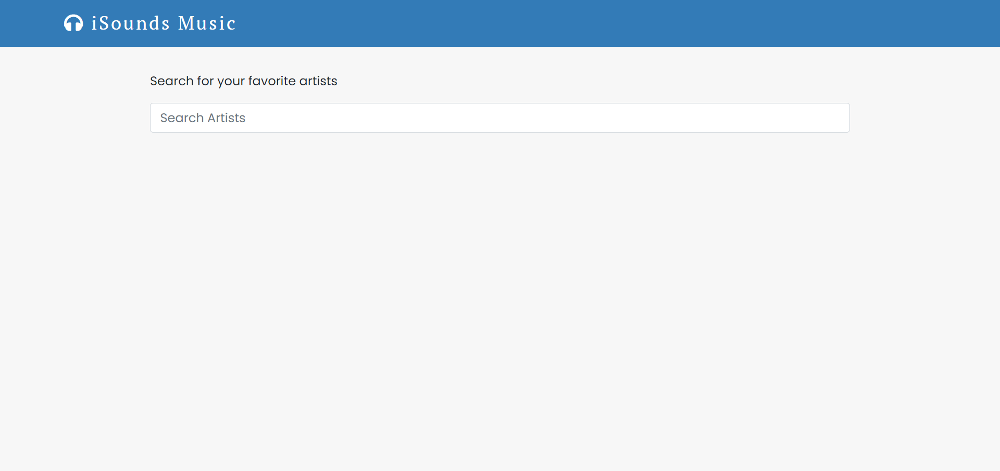
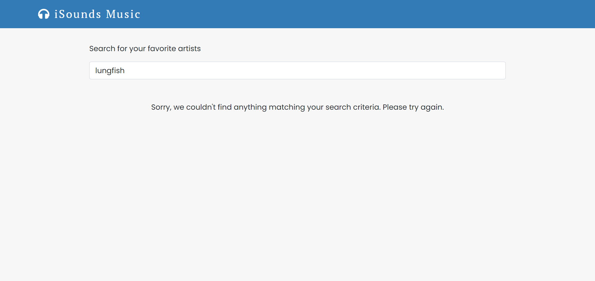
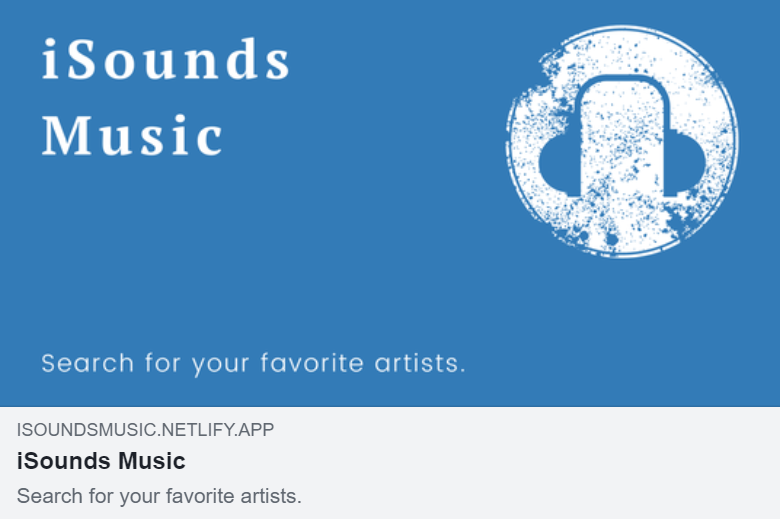
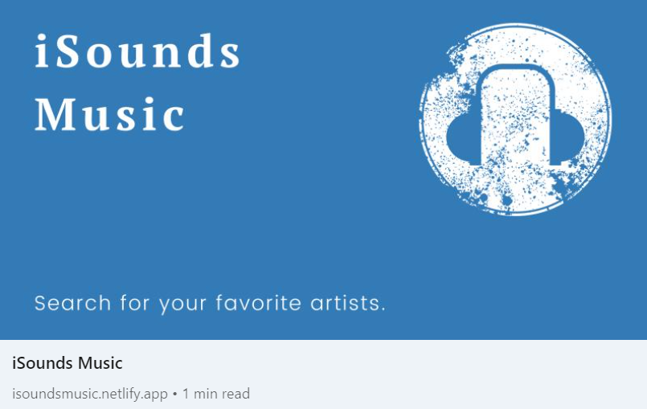

# iSounds Music


## Description

iSounds Music is a React application that allows you to search for your favorite artists. The user will then be able to navigate to see the artist's albums, which includes album information, such as album title, year the album was released, an image of the album cover, and more.

## iSounds Music Live Link

Please check out the live link for iSounds Music here: [iSounds Music](https://isoundsmusic.netlify.app/ "iSounds Music")

## Table of Contents
* [Technologies Used](#Technologies-Used)
* [Development](#Development)
  - [API Development](#API-Development)
  - [Site Development](#Site-Development)
* [Screenshots](#Screenshots)

## Technologies Used

* React (Hooks)
* React Router
* React Helmet
* React Bootstrap
* The AudioDB API
* CSS (CSS Modules)
* Google Fonts
* Facebook Developer Tools (Sharing Debugger)
* Canva
* Netlify

[Back To Top](#Table-of-Contents)

## Development

iSounds Music fetches data from [The AudioDB API](https://www.theaudiodb.com/api_guide.php "The AudioDB API"). Two different endpoints were used: one endpoint to fetch artist details by name, and a second to fetch album details from the artists. Dynamic routing was set up so that when a user goes to an artist's page to view the album information, only that artist's album information will show in its own page with its own route and `id` in the URL. In addition, React Helmet was set up in such a way that the browser tab will display the particular artist's name when the user goes to the artist's album page. For example, if a user searches for Tom Waits, and then goes to Tom Waits's album page, the browser tab will show: "iSounds Music | Albums | Tom Waits".

### API Development

To build the [API](https://github.com/answebdev/twilight-zone-api/ "The Twilight Zone API Documentation"), a JSON file was initially created for all of the data (all five seasons: episodes, air date, images, etc.). A server was then created in order to serve the data from the JSON file and then deploy the data endpoint using Heroku. In order to create different endpoints for the API (create a different endpoint for each season and one for all the episodes), I created separate `.js` files for each of the endpoints and their data. (i.e., `episodes.js` contained the data for all of the episodes, `season1.js` contained all of the data for Season 1, etc.). All of these files were exported separately by their endpoint name and brought into a new `db.js` file (see code below), which in turn was brought in to use in the server (`server.js`) as a single file.

```
const episodes = require('./episodes');
const season1 = require('./season1');
const season2 = require('./season2');
const season3 = require('./season3');
const season4 = require('./season4');
const season5 = require('./season5');

module.exports = () => ({
  episodes,
  season1,
  season2,
  season3,
  season4,
  season5,
});
```

This made it possible to serve and thus, deploy, each of these endpoints separately, which in the end resulted in a set of 6 common resources: `/episodes`, `/season1`, `/season2`, `/season3`, `/season4`, `/season5`, and `/season6`. At this point, the initial JSON file was no longer needed, since all of the data was converted into `.js` files, as described above. To test the endpoints, I used Postman and Paw Cloud, and also created a simple site in order to test each of the endpoints by first fetching, and then displaying the data from the API in the browser:


### Site Development

This site was created for the documentation of the custom-built Twilight Zone API and provides all of the information needed to start making HTTP requests, including a set of six common resources that the API comes with. It was built with React and uses Prism for the syntax highlighting. To make the site responsive and mobile-friendly, Flexbox and media queries were used in conjunction with Responsively App. In addition, smoothscroll polyfill was used so that the smooth scroll behavior can be used in browsers that do not support smooth scrolling (e.g., Safari). Finally, after Open Graph meta tags were added, the Facebook Sharing Debugger tool was used to scrape the site so that when the site's URL is posted and shared (e.g., on Facebook), its content will be shown (see last two screenshots below in Screenshots section).

#### Removing the Anchor Link ID Tags and Hashes from the URL

The site's home page has two buttons in the hero section: "Get Started" and "Resources", and they both navigate the user to different sections of the same page. "Get Started" navigates a user to the Documents section of the page, while "Resources" navigates a user to the Resources section of the page. As they are anchor links used to navigate to a different section of the same page, the sections are given the URLs `#docs` and `#resources`, respectively. When a button is clicked to navigate to its respective section of the page, the hash and `id` will show in the URL (e.g., `thetwilightzoneapi.netlify.app/#docs`), which is something I did not want. To address this, I was able to remove the hash and anchor link `id` from the URL, based on a [solution](https://www.finsweet.com/hacks/15/ "Remove anchor link id tag and # on urls within the same page") I had come across, and adapting it to work in my own setting by creating my own component - which I called `handleHashUrl` - in a `utils` folder that I would then be able to use to achieve this.

I started by giving each of the anchor link buttons in `Home.js` a class of `hashed` in order to be able to select them in the function. Clicking on each of these buttons navigates the user to the appropriate section of the page, each containing either the link URL of `#docs` or `#resources`, depending on which button is clicked.

```
<div className={classes.Buttons}>
  <a
    href={'#docs'}
    className={`${classes.GetStarted} ${'hashed'}`}
  >
    Get Started
  </a>

  <a
    href={'#resources'}
    className={`${classes.GetStarted} ${'hashed'}`}
  >
    Resources
  </a>
</div>
```

Back in the `handleHashUrl` component that I created, I began by first converting everything from the original jQuery to JavaScript. I then selected the anchor link buttons with the class of `hashed` and added a `forEach` to loop through them, since I had more than one that I was targeting. A `setTimeout` is needed to give it enough time (in this case, 5 milliseconds) to actually do the anchor scroll before running the `removeHash` function, which is what actually removes the hash from the URL.

```
const handleHashUrl = () => {
  document.addEventListener('DOMContentLoaded', function (event) {
    const menuBtn = document.querySelectorAll('.hashed');
    menuBtn.forEach(function (el) {
      el.addEventListener('click', function () {
        setTimeout(() => {
          removeHash();
        }, 5);
      });
    });
    function removeHash() {
      window.history.replaceState(
        '',
        document.title,
        window.location.origin +
          window.location.pathname +
          window.location.search
      );
    }
  });
};

export default handleHashUrl;
```

Finally, `handleHashUrl` was imported and used in `Home.js`, and this is what worked. And so now, when either of these buttons are clicked to navigate to another section of the page, the hash and anchor link `id` will no longer show in the URL (though you might see it briefly flash in the URL, because of the 5 milliseconds it was given before being removed), which is the desired result.


[Back To Top](#Table-of-Contents)

## Screenshots









[Back To Top](#Table-of-Contents)
